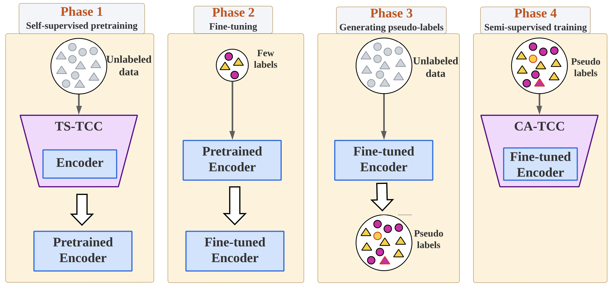

# Self-supervised Contrastive Representation Learning for Semi-supervised Time-Series Classification (CA-TCC) [[Paper](http://arxiv.org/abs/2208.06616)] [[Cite](#citation)]

## The paper is accepted in the [IEEE Transactions on Pattern Analysis and Machine Intelligence (**TPAMI**)](https://ieeexplore.ieee.org/document/10233092)

## This work is an extention to [TS-TCC](https://github.com/emadeldeen24/TS-TCC), so if you need any details about the unsupervised pretraining and/or the datasets and its preprocessing, please check it first.

### Training modes:
<p align="center">

</p>

CA-TCC has two new training modes over TS-TCC
- "gen_pseudo_labels": which generates pseudo labels from fine-tuned TS-TCC model. This mode assumes that you ran "ft_1per" mode first.
- "SupCon": which performs supervised contrasting on pseudo-labeled data.

Note that "SupCon" is case-sensitive.

To fine-tune or linearly evaluate "SupCon" pretrained model, include it in the training mode.
For example: "ft_1per" will fine-tune the TS-TCC pretrained model with 1% of labeled data.
"ft_SupCon_1per" will fine-tune the CA-TCC pretrained model with 1% of labeled data.
The same applies to "tl" or "train_linear".

To generate the 1%, you just need to split the data into 1%-99% and take the 1%.
Also, you can find a script that does a [similar job here](https://github.com/emadeldeen24/eval_ssl_ssc/blob/main/split_k-fold_and_few_labels.py). However, note that it creates it for 5-fold, so you can set it to just 1-fold.

### Baselines:
The codes of the self- and semi-supervised learning baselines I used in the paper are [HERE](https://github.com/emadeldeen24/semi-supervised_baselines).

The codes of the self-supervised learning baselines I used in the paper can be found in [my other work](https://github.com/emadeldeen24/eval_ssl_ssc).

### Training procedure
To run everything smoothly, we included `ca_tcc_pipeline.sh` file. You can simply use it.


## Citation
If you found this work useful for you, please consider citing it.
```
@inproceedings{tstcc,
  title     = {Time-Series Representation Learning via Temporal and Contextual Contrasting},
  author    = {Eldele, Emadeldeen and Ragab, Mohamed and Chen, Zhenghua and Wu, Min and Kwoh, Chee Keong and Li, Xiaoli and Guan, Cuntai},
  booktitle = {Proceedings of the Thirtieth International Joint Conference on Artificial Intelligence, {IJCAI-21}},
  pages     = {2352--2359},
  year      = {2021},
}
```
```
@ARTICLE{catcc,
  author={Eldele, Emadeldeen and Ragab, Mohamed and Chen, Zhenghua and Wu, Min and Kwoh, Chee-Keong and Li, Xiaoli and Guan, Cuntai},
  journal={IEEE Transactions on Pattern Analysis and Machine Intelligence}, 
  title={Self-Supervised Contrastive Representation Learning for Semi-Supervised Time-Series Classification}, 
  year={2023},
  volume={45},
  number={12},
  pages={15604-15618},
  doi={10.1109/TPAMI.2023.3308189}
}
```

## Contact
Please contact me for any issues/questions regarding the paper or reproducing the results at: emad0002{at}e.ntu.edu.sg   
